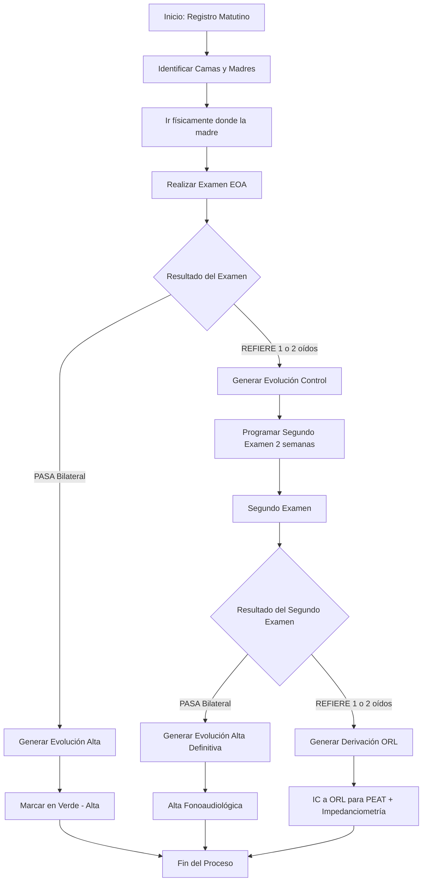
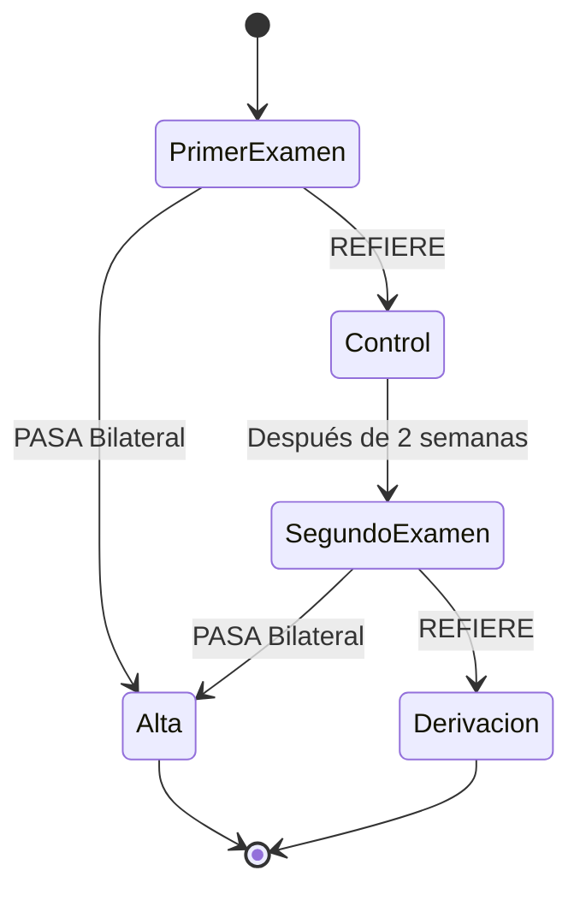

# Flujo de Trabajo - Sistema TAU (Tamizaje Auditivo Universal)

## Tabla de Contenidos
1. [Descripción General](#descripción-general)
2. [Diagrama de Flujo del Proceso](#diagrama-de-flujo-del-proceso)
3. [Guía de Usuario - Paso a Paso](#guía-de-usuario---paso-a-paso)
4. [Flujo de Primer Examen](#flujo-de-primer-examen)
5. [Flujo de Segundo Examen](#flujo-de-segundo-examen)
6. [Ejemplos Prácticos](#ejemplos-prácticos)
7. [Aspectos Técnicos](#aspectos-técnicos)
8. [Mejores Prácticas](#mejores-prácticas)
9. [Solución de Problemas](#solución-de-problemas)

---

## Descripción General

El Sistema TAU (Tamizaje Auditivo Universal) es una aplicación web progresiva (PWA) diseñada para el Hospital San Luis de Buin que facilita el seguimiento de exámenes de Emisiones Otoacústicas (EOA) en recién nacidos.

### Propósito Principal
- Registrar datos de madres y sus bebés
- Realizar exámenes EOA con resultados de oído derecho e izquierdo
- Generar evoluciones clínicas automáticamente según los resultados
- Mantener un historial completo de los exámenes realizados

### Flujo Resumido
1. **Registro Matutino**: Identificación de camas y madres a examinar
2. **Examen Físico**: Realización del examen EOA al bebé
3. **Registro de Resultados**: Ingreso de resultados y datos clínicos
4. **Generación de Evolución**: Creación automática de evolución según resultado
5. **Seguimiento**: Control de bebés que requieren segundo examen

---

## Diagrama de Flujo del Proceso



### Estados del Bebé en el Sistema



---

## Guía de Usuario - Paso a Paso

### 1. Registro Matutino de Pacientes

**Paso 1.1: Identificación de Camas**
- Al inicio del turno, revisar las camas asignadas
- Anotar nombre de la madre, RUT, sala y cama
- Registrar cantidad de hijos si aplica

**Paso 1.2: Registro en el Sistema**
1. Ingresar a la aplicación TAU
2. Hacer clic en "Registrar Madre"
3. Completar el formulario con:
   - Nombre y apellido de la madre
   - RUT (formato: 12345678-9)
   - Número de ficha clínica
   - Sala y cama
   - Cantidad de hijos

### 2. Realización del Examen EOA

**Paso 2.1: Preparación**
- Dirigirse físicamente a la sala/cama indicada
- Verificar identidad de la madre
- Preparar equipo EOA

**Paso 2.2: Ejecución del Examen**
- Realizar examen en oído derecho (OD)
- Realizar examen en oído izquierdo (OI)
- Registrar resultados:
  - **PASA**: Si el oído supera el examen
  - **REFIERE**: Si el oído no supera el examen

### 3. Registro en el Sistema

**Paso 3.1: Acceso al Formulario EOA**
1. Desde el dashboard, hacer clic en "Ver Madres Registradas"
2. Buscar a la madre por RUT o ficha
3. Hacer clic en "Realizar Examen EOA"

**Paso 3.2: Completar Datos del Examen**
1. **Resultados del Examen**:
   - Seleccionar resultado para OD (PASA/REFIERE)
   - Seleccionar resultado para OI (PASA/REFIERE)

2. **Información del Bebé**:
   - Fecha de nacimiento
   - Sexo del bebé
   - Tipo de parto (Normal/Cesárea)
   - Semanas de gestación

3. **Antecedentes y Factores de Riesgo**:
   - Complicaciones en el embarazo
   - Complicaciones en el desarrollo
   - Familiares con pérdida auditiva
   - Consumo de sustancias durante embarazo

4. **Observaciones** (opcional)

**Paso 3.3: Guardar y Exportar**
- Hacer clic en "Guardar Examen" para registrar
- Opcional: Hacer clic en "Exportar Evolución" para descargar el texto

---

## Flujo de Primer Examen

### Escenario 1: PASA Bilateral (Verde)

**Condición**: OD = PASA Y OI = PASA

**Proceso**:
1. El sistema automáticamente genera la evolución:
```
FONOAUDIOLOGÍA - EOA

•   Fecha de nacimiento: [fecha]
•   Semana de gestación: [semanas]
•   Tipo de parto: [tipo]
•   Complicaciones embarazo: [detalles]
•   Uso de drogas/ Alcohol/ Cigarros: [detalles]
•   Antecedentes mórbidos familiares: [presentes/ausentes]
•   Resultado EOA: OD: (PASA)   OI: (PASA)

Se da alta fonoaudiológica.
```

2. El registro se marca en **verde** en el sistema
3. No se requiere seguimiento adicional
4. El bebé queda dado de alta del programa

### Escenario 2: REFIERE (1 o 2 oídos)

**Condición**: OD = REFIERE Y/O OI = REFIERE

**Proceso**:
1. El sistema genera la evolución:
```
FONOAUDIOLOGÍA - EOA

•   Fecha de nacimiento: [fecha]
•   Semana de gestación: [semanas]
•   Tipo de parto: [tipo]
•   Complicaciones embarazo: [detalles]
•   Uso de drogas/ Alcohol/ Cigarros: [detalles]
•   Antecedentes mórbidos familiares: [presentes/ausentes]
•   Resultado EOA: OD: ([resultado])   OI: ([resultado])

Se solicita asistir nuevamente a la realización del examen en 2 semanas más. En carnet del RN queda informativo para pedir hora.
```

2. El registro se marca en **amarillo/naranja** (pendiente)
3. Se deja constancia en el carnet del recién nacido
4. Se programa control en 2 semanas

---

## Flujo de Segundo Examen

### Escenario 1: PASA Bilateral en Repetición

**Condición**: En segundo examen, OD = PASA Y OI = PASA

**Proceso**:
1. El sistema genera la evolución:
```
FONOAUDIOLOGÍA - EOA

Usuaria asiste junto a su bebé para repetir examen de audición.

•    Resultado EOA: OD: (PASA) OI: (PASA)

Se educa a la usuaria para estimulación temprana del lenguaje.
Se da alta fonoaudiológica.
```

2. El registro se marca en **verde** (alta definitiva)
3. Se proporciona orientación sobre estimulación temprana
4. El bebé queda dado de alta

### Escenario 2: REFIERE en Repetición

**Condición**: En segundo examen, OD = REFIERE Y/O OI = REFIERE

**Proceso**:
1. El sistema genera la evolución:
```
FONOAUDIOLOGÍA - EOA

Usuaria asiste junto a su bebé para repetir examen de audición.

•    Resultado EOA: OD: ([resultado]) OI: ([resultado])

Se realiza IC a ORL de HBLT para realización de PEAT + Impedanciometría por sospecha de Hipoacusia
```

2. El registro se marca en **rojo** (derivación requerida)
3. Se realiza interconsulta a Otorrinolaringología
4. Se solicitan exámenes especializados:
   - PEAT (Potenciales Evocados Auditivos de Tronco Cerebral)
   - Impedanciometría

---

## Ejemplos Prácticos

### Ejemplo 1: Primer Examen - Alta Directa

**Datos del Paciente**:
- Madre: María González, RUT: 12.345.678-9
- Bebé: José, nacido 15/10/2024
- Parto normal, 38 semanas

**Resultados EOA**: OD: PASA, OI: PASA

**Evolución Generada**:
```
FONOAUDIOLOGÍA - EOA

•   Fecha de nacimiento: 15/10/2024
•   Semana de gestación: 38
•   Tipo de parto: Parto normal
•   Complicaciones embarazo: Sin antecedentes
•   Uso de drogas/ Alcohol/ Cigarros: Drogas: No / Alcohol: No / Cigarros: No
•   Antecedentes mórbidos familiares: Ausentes
•   Resultado EOA: OD: (PASA)   OI: (PASA)

Se da alta fonoaudiológica.
```

**Estado en Sistema**: ✅ Verde - Alta

### Ejemplo 2: Primer Examen - Control Requerido

**Datos del Paciente**:
- Madre: Ana Rodríguez, RUT: 98.765.432-1
- Bebé: Sofía, nacida 20/10/2024
- Cesárea, 36 semanas, complicaciones

**Resultados EOA**: OD: REFIERE, OI: PASA

**Evolución Generada**:
```
FONOAUDIOLOGÍA - EOA

•   Fecha de nacimiento: 20/10/2024
•   Semana de gestación: 36
•   Tipo de parto: Cesárea
•   Complicaciones embarazo: Preeclampsia
•   Uso de drogas/ Alcohol/ Cigarros: Drogas: No / Alcohol: No / Cigarros: Sí
•   Antecedentes mórbidos familiares: Presentes
•   Resultado EOA: OD: (REFIERE)   OI: (PASA)

Se solicita asistir nuevamente a la realización del examen en 2 semanas más. En carnet del RN queda informativo para pedir hora.
```

**Estado en Sistema**: 🟡 Amarillo - Control en 2 semanas

### Ejemplo 3: Segundo Examen - Derivación

**Datos del Paciente**:
- Misma paciente del ejemplo 2
- Segundo examen: 03/11/2024

**Resultados EOA**: OD: REFIERE, OI: REFIERE

**Evolución Generada**:
```
FONOAUDIOLOGÍA - EOA

Usuaria asiste junto a su bebé para repetir examen de audición.

•    Resultado EOA: OD: (REFIERE) OI: (REFIERE)

Se realiza IC a ORL de HBLT para realización de PEAT + Impedanciometría por sospecha de Hipoacusia
```

**Estado en Sistema**: 🔴 Rojo - Derivación ORL

---

## Aspectos Técnicos

### Arquitectura del Sistema

**Frontend**:
- HTML5, CSS3, JavaScript (Vanilla)
- Progressive Web App (PWA)
- Diseño responsivo para móviles y escritorio

**Backend**:
- Supabase como base de datos y backend-as-a-service
- Tiempo real con sincronización automática
- Funcionamiento offline con sincronización posterior

### Estructura de Datos

**Tabla `madres`**:
```sql
CREATE TABLE madres (
  id UUID PRIMARY KEY,
  nombre VARCHAR(100) NOT NULL,
  apellido VARCHAR(100) NOT NULL,
  rut VARCHAR(12) NOT NULL UNIQUE,
  numero_ficha VARCHAR(20) NOT NULL,
  sala VARCHAR(10) NOT NULL,
  cama VARCHAR(10) NOT NULL,
  cantidad_hijos INTEGER NOT NULL,
  created_at TIMESTAMP WITH TIME ZONE DEFAULT NOW(),
  updated_at TIMESTAMP WITH TIME ZONE DEFAULT NOW()
);
```

**Tabla `examenes_eoa`**:
```sql
CREATE TABLE examenes_eoa (
  id UUID PRIMARY KEY,
  madre_id UUID REFERENCES madres(id) ON DELETE CASCADE,
  nombre VARCHAR(100) NOT NULL,
  apellido VARCHAR(100) NOT NULL,
  od_resultado VARCHAR(10) NOT NULL CHECK (od_resultado IN ('PASA', 'REFIERE')),
  oi_resultado VARCHAR(10) NOT NULL CHECK (oi_resultado IN ('PASA', 'REFIERE')),
  fecha_nacimiento DATE,
  sexo_bebe VARCHAR(10) CHECK (sexo_bebe IN ('MASCULINO', 'FEMENINO')),
  tipo_parto VARCHAR(15) CHECK (tipo_parto IN ('NORMAL', 'CESAREA')),
  semanas_gestacion INTEGER CHECK (semanas_gestacion > 0 AND semanas_gestacion <= 42),
  complicaciones_embarazo TEXT,
  complicaciones_desarrollo TEXT,
  familiares_perdida_auditiva BOOLEAN,
  madre_fumo BOOLEAN,
  madre_alcohol BOOLEAN,
  madre_drogas BOOLEAN,
  observaciones TEXT,
  fecha_examen TIMESTAMP WITH TIME ZONE DEFAULT NOW(),
  created_at TIMESTAMP WITH TIME ZONE DEFAULT NOW()
);
```

### Lógica de Generación de Evoluciones

**Función Principal** (`generarTextoEvolucion` en `js/eoa.js`):

```javascript
function generarTextoEvolucion(examenData, numeroExamen) {
    const resultadoRefiere = esResultadoRefiere(examenData);
    
    if (numeroExamen <= 1) {
        // Lógica para primer examen
        if (resultadoRefiere) {
            // Evolución con control
        } else {
            // Evolución con alta
        }
    } else {
        // Lógica para segundo examen
        if (resultadoRefiere) {
            // Evolución con derivación
        } else {
            // Evolución con alta definitiva
        }
    }
}
```

### Identificación de Número de Examen

El sistema determina automáticamente si es primer o segundo examen:
```javascript
async function cargarExamenesAnteriores(madreId) {
    const { data, count } = await supabase
        .from('examenes_eoa')
        .select('*', { count: 'exact' })
        .eq('madre_id', madreId);
    
    currentMadreExamenCount = count || 0;
}
```

### Estados Visuales en la Interfaz

**Código de Colores**:
- 🟢 **Verde**: Alta fonoaudiológica (PASA bilateral)
- 🟡 **Amarillo**: Control requerido (REFIERE en primer examen)
- 🔴 **Rojo**: Derivación ORL (REFIERE en segundo examen)

---

## Mejores Prácticas

### Para el Personal de Salud

1. **Registro Matutino**:
   - Realizar siempre al inicio del turno
   - Verificar datos de identificación de la madre
   - Confirmar ubicación (sala y cama)

2. **Durante el Examen**:
   - Asegurar ambiente tranquilo
   - Verificar estado del bebé (descansado, alimentado)
   - Limpiar adecuadamente los equipos

3. **Registro de Datos**:
   - Completar todos los campos obligatorios
   - Ser específico en las observaciones
   - Verificar resultados antes de guardar

4. **Seguimiento**:
   - Marcar claramente en el carnet del RN
   - Explicar a la madre la importancia del control
   - Confirmar fecha y hora del próximo examen

### Para el Mantenimiento del Sistema

1. **Respaldo de Datos**:
   - Realizar respaldos periódicos de la base de datos
   - Mantener registro de exportaciones realizadas

2. **Actualizaciones**:
   - Mantener la aplicación actualizada
   - Verificar compatibilidad con navegadores

3. **Capacitación**:
   - Capacitar al nuevo personal en el uso del sistema
   - Realizar refrescamiento periódico de procedimientos

### Flujo de Comunicación

1. **Entre Turnos**:
   - Dejar registro claro de exámenes pendientes
   - Comunicar casos especiales o complicaciones

2. **Con Otros Servicios**:
   - Canalizar adecuadamente las derivaciones a ORL
   - Mantener comunicación con neonatología

---

## Solución de Problemas

### Problemas Comunes y Soluciones

**Problema 1: No puedo registrar una madre**
- **Causa**: RUT duplicado o formato incorrecto
- **Solución**: Verificar formato (12345678-9) y que no exista previamente

**Problema 2: El examen no se guarda**
- **Causa**: Campos obligatorios incompletos
- **Solución**: Verificar que todos los campos requeridos estén completos

**Problema 3: No se genera la evolución**
- **Causa**: Error en la selección de resultados
- **Solución**: Asegurar que ambos oídos tengan resultado seleccionado

**Problema 4: El sistema funciona lento**
- **Causa**: Problemas de conexión a internet
- **Solución**: Verificar conexión o usar modo offline

### Mensajes de Error Comunes

| Error | Significado | Solución |
|-------|-------------|----------|
| "RUT ya está registrado" | La madre ya existe en el sistema | Buscar la madre existente |
| "Complete todos los campos" | Faltan datos obligatorios | Revisar formulario completo |
| "Error de conexión" | Problemas con Supabase | Verificar conexión a internet |
| "Resultado inválido" | Selección incorrecta de EOA | Seleccionar PASA o REFIERE |

### Contacto de Soporte

Para problemas técnicos del sistema:
- **Administrador del Sistema**: [Contacto TI]
- **Soporte Clínico**: [Supervisor Fonoaudiología]

---

## Anexos

### Glosario de Términos

- **EOA**: Emisiones Otoacústicas
- **OD**: Oído Derecho
- **OI**: Oído Izquierdo
- **PASA**: Supera el examen auditivo
- **REFIERE**: No supera el examen, requiere derivación
- **PEAT**: Potenciales Evocados Auditivos de Tronco Cerebral
- **IC**: Interconsulta
- **ORL**: Otorrinolaringología
- **RN**: Recién Nacido

### Checklist Diario

- [ ] Revisión de camas asignadas
- [ ] Registro de nuevas madres
- [ ] Realización de exámenes EOA
- [ ] Verificación de datos completos
- [ ] Generación de evoluciones
- [ ] Marcado de carnet RN cuando corresponde
- [ ] Programación de controles
- [ ] Registro de derivaciones

### Referencias Normativas

- **Norma Ministerial**: Tamizaje Auditivo Neonatal Universal
- **Protocolo Hospital San Luis de Buin**: Detección Temprana de Hipoacusia
- **Guía Clínica**: Seguimiento de Recién Nacidos de Riesgo

---

*Documento actualizado: Noviembre 2024*
*Versión: 1.0*
*Sistema TAU - Hospital San Luis de Buin*