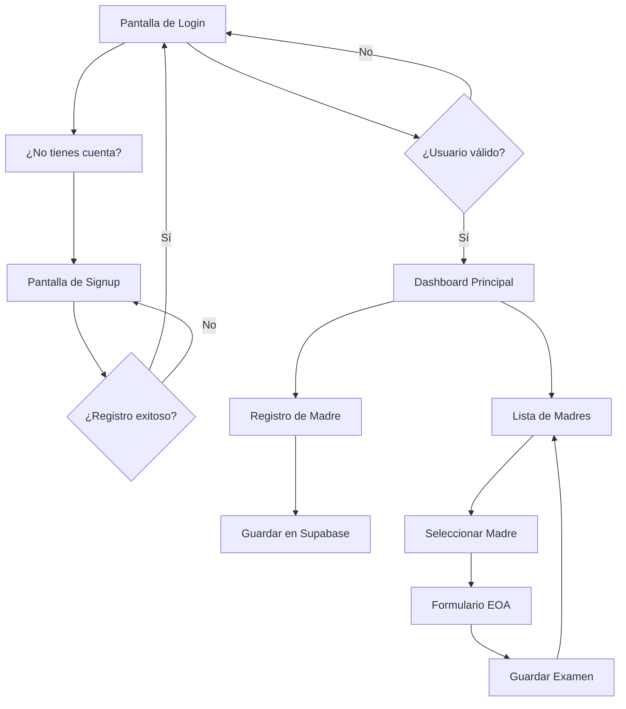

# TAU - Tamizaje Auditivo Universal

Aplicación PWA para el registro y seguimiento de exámenes de Emisiones Otoacústicas (EOA) en recién nacidos del Hospital San Luis de Buin.

## Descripción del Proyecto

TAU (Tamizaje Auditivo Universal) es una aplicación web progresiva (PWA) diseñada para facilitar el registro y seguimiento de exámenes auditivos en recién nacidos. La aplicación permite:

- Registrar datos de las madres (RUT, ficha, sala, cama)
- Realizar exámenes EOA con resultados de oído derecho e izquierdo
- Sincronización en tiempo real usando Supabase
- Funcionamiento offline con sincronización posterior
- Acceso desde dispositivos móviles y computadoras de escritorio

## Tecnologías Utilizadas

- **Frontend**: HTML5, CSS3, JavaScript (Vanilla)
- **Backend**: Supabase (Base de datos + Autenticación)
- **Arquitectura**: Progressive Web App (PWA)
- **Sincronización**: Tiempo real con Supabase

## Estructura del Proyecto

```
app-tau/
├── index.html              # Página principal (login)
├── signup.html             # Registro de usuarios
├── dashboard.html          # Panel principal después del login
├── css/
│   ├── styles.css          # Estilos generales
│   ├── auth.css            # Estilos de autenticación
│   └── dashboard.css       # Estilos del dashboard
├── js/
│   ├── auth.js             # Funcionalidad de autenticación
│   ├── dashboard.js        # Lógica del dashboard
│   ├── madres.js           # Gestión de registros de madres
│   ├── eoa.js              # Funcionalidad de exámenes EOA
│   └── utils.js            # Utilidades (validación RUT, etc.)
├── manifest.json           # Configuración PWA
├── sw.js                   # Service Worker para funcionalidad offline
├── assets/
│   └── icons/              # Iconos de la aplicación
└── README.md               # Este archivo
```

## Esquema de Base de Datos (Supabase)

### Tabla de Usuarios (manejada por Supabase Auth)
- id (UUID)
- email
- created_at

### Tabla de Perfiles de Usuario
```sql
CREATE TABLE perfiles (
  id UUID REFERENCES auth.users(id) PRIMARY KEY,
  nombre_usuario VARCHAR(50) NOT NULL,
  updated_at TIMESTAMP WITH TIME ZONE DEFAULT NOW()
);
```

### Tabla de Madres
```sql
CREATE TABLE madres (
  id UUID DEFAULT gen_random_uuid() PRIMARY KEY,
  rut VARCHAR(12) NOT NULL UNIQUE,
  numero_ficha VARCHAR(20) NOT NULL,
  sala VARCHAR(10) NOT NULL,
  cama VARCHAR(10) NOT NULL,
  usuario_id UUID REFERENCES perfiles(id),
  created_at TIMESTAMP WITH TIME ZONE DEFAULT NOW(),
  updated_at TIMESTAMP WITH TIME ZONE DEFAULT NOW()
);
```

### Tabla de Exámenes EOA
```sql
CREATE TABLE examenes_eoa (
  id UUID DEFAULT gen_random_uuid() PRIMARY KEY,
  madre_id UUID REFERENCES madres(id) ON DELETE CASCADE,
  od_resultado VARCHAR(10) NOT NULL CHECK (od_resultado IN ('PASA', 'REFIERE')),
  oi_resultado VARCHAR(10) NOT NULL CHECK (oi_resultado IN ('PASA', 'REFIERE')),
  observaciones TEXT,
  fecha_examen TIMESTAMP WITH TIME ZONE DEFAULT NOW(),
  usuario_id UUID REFERENCES perfiles(id),
  created_at TIMESTAMP WITH TIME ZONE DEFAULT NOW()
);
```

## Flujo de la Aplicación



## Plan de Desarrollo

### Fase 1: Configuración Inicial
- [x] Crear archivo README.md con plan completo del proyecto
- [ ] Configurar proyecto inicial con estructura de archivos
- [ ] Inicializar repositorio Git y conectar con GitHub
- [ ] Configurar Supabase: crear proyecto y definir esquema de base de datos
- [ ] Configurar autenticación de Supabase (Auth)

### Fase 2: Autenticación
- [ ] Diseñar e implementar pantalla de login
- [ ] Diseñar e implementar pantalla de registro (signup)
- [ ] Implementar validación de formularios de autenticación
- [ ] Configurar protección de rutas y sesión de usuario

### Fase 3: Funcionalidad Principal
- [ ] Diseñar interfaz principal de registro de madres
- [ ] Implementar formulario de registro de madre (RUT, ficha, sala, cama)
- [ ] Crear lista de madres registradas con navegación a EOA
- [ ] Diseñar e implementar formulario EOA (OD, OI, observaciones)
- [ ] Configurar sincronización en tiempo real con Supabase

### Fase 4: Optimización y PWA
- [ ] Implementar funcionalidad PWA (manifest, service worker)
- [ ] Agregar validación de RUT chileno
- [ ] Probar funcionalidad completa y sincronización
- [ ] Optimizar interfaz para dispositivos móviles y escritorio

## Características Técnicas

### Autenticación
- Registro de usuarios con nombre, correo y contraseña
- Validación de correo electrónico
- Confirmación de contraseña
- Sesiones persistentes
- Protección de rutas

### Validaciones
- RUT chileno con formato y dígito verificador
- Correo electrónico válido
- Contraseña mínima 6 caracteres
- Campos obligatorios en formularios

### PWA Features
- Instalable en dispositivos móviles
- Funcionamiento offline con sincronización
- Iconos adaptativos
- Interfaz responsiva

## Políticas de Seguridad (RLS)

```sql
-- Solo usuarios autenticados pueden ver/crear registros
CREATE POLICY "Usuarios autenticados pueden ver madres" ON madres
  FOR SELECT USING (auth.role() = 'authenticated');

CREATE POLICY "Usuarios autenticados pueden insertar madres" ON madres
  FOR INSERT WITH CHECK (auth.role() = 'authenticated');

CREATE POLICY "Usuarios solo pueden ver sus propios registros" ON madres
  FOR ALL USING (auth.uid() = usuario_id);

-- Similar para examenes_eoa
```

## Actualizaciones del Progreso

*Este archivo se actualizará a medida que se completen las tareas del plan de desarrollo.*

### Estado Actual:
- **Fase 1**: Completada ✅
- **Fase 2**: Completada ✅
- **Fase 3**: Completada ✅
- **Fase 4**: Completada ✅

### Progreso Detallado:
- [x] Crear archivo README.md con plan completo del proyecto
- [x] Configurar proyecto inicial con estructura de archivos
- [ ] Inicializar repositorio Git y conectar con GitHub
- [ ] Configurar Supabase: crear proyecto y definir esquema de base de datos
- [x] Configurar autenticación de Supabase (Auth)
- [x] Diseñar e implementar pantalla de login
- [x] Diseñar e implementar pantalla de registro (signup)
- [x] Implementar validación de formularios de autenticación
- [x] Configurar protección de rutas y sesión de usuario
- [x] Diseñar interfaz principal de registro de madres
- [x] Implementar formulario de registro de madre (RUT, ficha, sala, cama)
- [x] Crear lista de madres registradas con navegación a EOA
- [x] Diseñar e implementar formulario EOA (OD, OI, observaciones)
- [x] Configurar sincronización en tiempo real con Supabase
- [x] Implementar funcionalidad PWA (manifest, service worker)
- [x] Agregar validación de RUT chileno
- [ ] Probar funcionalidad completa y sincronización
- [ ] Optimizar interfaz para dispositivos móviles y escritorio

## Instrucciones de Instalación y Uso

*(Se completará cuando la aplicación esté funcional)*

## Contribución

*(Se completará cuando el proyecto esté en GitHub)*

## Licencia

*(Se definirá más adelante)*